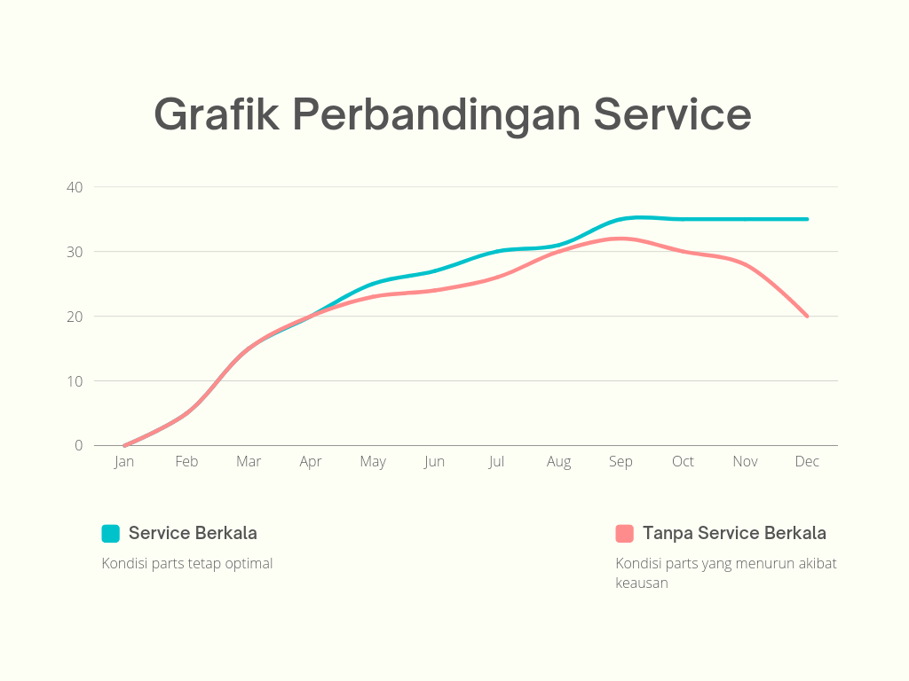

# 🛠️ Panduan Service Berkala Pada Motor Matic Injeksi

> **Note**: Saya sama sekali tidak berafiliasi pada produk tertentu, ini hanya rangkuman menurut teori dan praktek yang telah saya pelajari selama beberapa waktu. 
>
> Catatan ini masih dalam tahap penulisan secara bertahap.

_Service_? apa itu _service_? dalam dunia otomotif **service adalah suatu cara untuk memperbaiki, mengganti, membersihkan dan mengoptimalkan kembali performa kendaraan yang telah digunakan agar kondisi mesin tetap dalam keadaan prima**. Mengingat setiap komponen pada kendaraan memiliki batas waktu penggunaannya tersendiri.

Disini jenis _service_ saya kelompokan menjadi 3 bagian, untuk mempermudah perhatikan tabel sebagai berikut.
| Jenis _Service_        | Pengerjaan |
|:----------------------:|------------|
| _Service_ Besar        | Meliputi area depan pada mesin utama, yaitu _cylinder head_ sampai dengan area belakang, yaitu _crankshaft_. Biasanya _service_ besar ini dilakukan secara menyeluruh saat kendaraan mengalami turun mesin atau kadang dapat disebut sebagai _overhaul_. |
| _Service_ Ringan       | Meliputi area pengereman, tekanan angin ban, kondisi ban, kondisi _shockbreaker_, kondisi _fuelpump_, _nozzle injector_, _throttle body_, filter udara, kondisi air radiator, busi, kondisi bearing, kondisi oli, kondisi seal, serta pengecekan pada area _Continuously Variable Transmission_ atau bisa disingkat dengan CVT. |
| _Service_ Kelistrikan  | Meliputi area kelistrikan seperti ECU, kiprok, ACCU, koil, sikring, saklar, perkabelan, dll. |

## Kapan Saya Harus Melakukan Service?
| Waktu _Service_ Berdasarkan _odometer_ | Jenis _Service_      | Jarak Waktu |
|:--------------------------------------:|:--------------------:|:------------|
| 2.500 KM - 4.500 KM                    | _Service_ Ringan     | 1 / 2 Bulan |
| 15.000 KM - 25.000 KM                  | _Service_ Besar      | 1 / 2 Tahun |
| -                                      | _Service_ Kelistrikan| -           |

> **Warning**: Pada jarak tempuh yang saya sebutkan diatas memiliki S&K dimana saya asumsikan kendaraan dalam keadaan prima. Acuannya adalah **tergantung mana yang sampai lebih dahulu, jarak KM atau jarak bulan**.

Biasanya beberapa orang termasuk saya sendiri sering berpedoman pada _odometer_ sebagai acuan jarak tempuh, namun semua kembali lagi terhadap pemilik kendaraan tersebut. Disini saya akan kelompokan 3 jenis yang umum dengan tabel sebagai berikut.
| Jarak Tempuh    | Tempo  | Contoh                             |
|:---------------:|--------|------------------------------------|
| > 100 KM        | 1 Hari | Ojol, Sales, Kurir, Marketing, dll.|
| < 70 KM         | 1 Hari | Pekerja, Mahasiswa/i, dll.         |
| < 30 KM         | 1 Hari | Antar Jemput Anak Sekolah, Kepasar |

Kendaraan dengan jarak tempuh dalam kurun waktu **1 hari > 100 KM pada umumnya harus lebih sering diperhatikan kondisi mesin serta melakukan check pada _dipstick_ oli**. 
> **Note**: Terutama keluarga Yamaha 125 CC karna memiliki bahan liner blok diasil yang terkenal dengan vampir oli.

