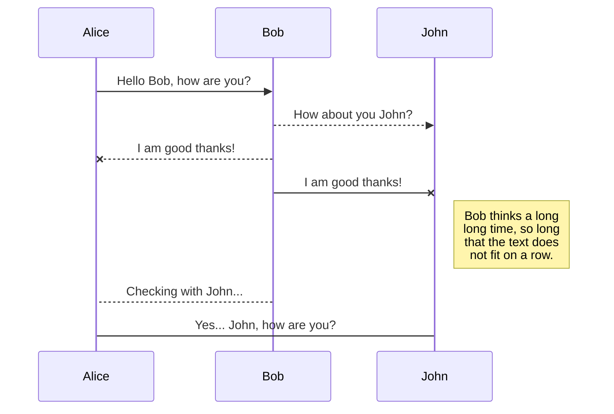
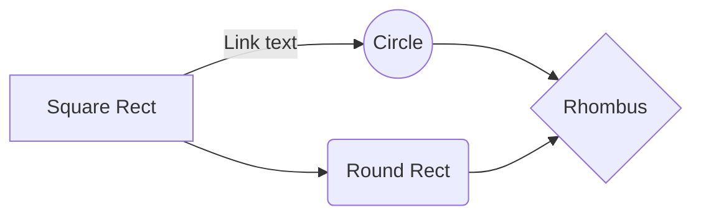

# 🛠️ Panduan Service Berkala Pada Motor Matic Injeksi

> **Note**: Saya sama sekali tidak berafiliasi pada produk tertentu, ini hanya rangkuman menurut teori dan praktek yang telah saya pelajari selama beberapa waktu. 
>
> Catatan ini masih dalam tahap penulisan secara bertahap.

_Service_? apa itu _service_? dalam dunia otomotif **service adalah suatu cara untuk memperbaiki, membersihkan dan mengoptimalkan kembali performa kendaraan yang telah digunakan agar kondisi mesin tetap prima dan optimal**.

_Service_ dapat dikelompokan menjadi 3 bagian, sebagai berikut.
1. _Service_ besar. Meliputi area depan pada mesin utama, yaitu _cylinder head_ sampai dengan area belakang, yaitu _crankshaft_. Biasanya _service_ besar ini dilakukan saat kendaraan mengalami turun mesin atau kadang dapat disebut sebagai _overhaul_.
2. _Service_ ringan. Meliputi area pengereman, tekanan angin ban, kondisi ban, kondisi _fuelpump_, _throttle body_, filter udara, kondisi bearing, serta pengecekan pada area _Continuously Variable Transmission_ atau bisa disingkat dengan CVT.
## Kapan Saya Harus Melakukan Service ?

|                |ASCII                          |HTML                         |
|----------------|-------------------------------|-----------------------------|
|Single backticks|`'Isn't this fun?'`            |'Isn't this fun?'            |
|Quotes          |`"Isn't this fun?"`            |"Isn't this fun?"            |
|Dashes          |`-- is en-dash, --- is em-dash`|-- is en-dash, --- is em-dash|

## KaTeX

You can render LaTeX mathematical expressions using [KaTeX](https://khan.github.io/KaTeX/):

The *Gamma function* satisfying $\Gamma(n) = (n-1)!\quad\forall n\in\mathbb N$ is via the Euler integral

$$
\Gamma(z) = \int_0^\infty t^{z-1}e^{-t}dt\,.
$$

> You can find more information about **LaTeX** mathematical expressions [here](http://meta.math.stackexchange.com/questions/5020/mathjax-basic-tutorial-and-quick-reference).

## UML diagrams

You can render UML diagrams using [Mermaid](https://mermaidjs.github.io/). For example, this will produce a sequence diagram:

And this will produce a flow chart:

---

Reference: https://stackedit.io/app#

